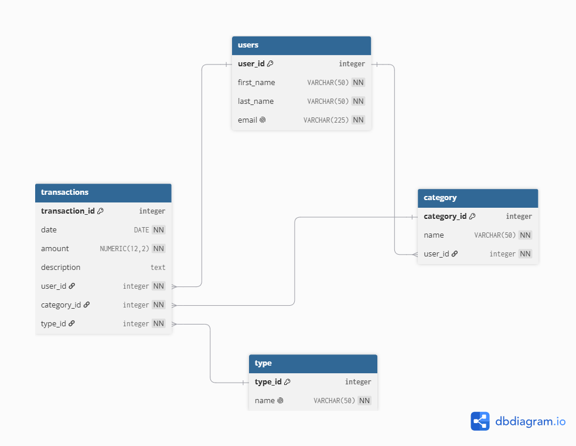

# Finance Data Pipeline

This project acts as an ETL pipeline for CSV files dealing with transactions. It extracts the data, validates/transforms it, and finally loads it to a PostgreSQL database where all information is stored.

## Features

- Extract transaction data from a CSV file
- Handle invalid file paths
- Transform/validate data to constraints of PostgreSQL database
- Load data into PostgreSQL database
- Roll back changes to database if load fails

## Technologies Used

- Python
- PostgreSQL
- Polars
- Psycopg
- python-dotenv
- Git

## ETL Pipeline

- **Extract:** program takes a valid file path to a CSV file with transaction information
- **Pre-validation:** checks file contains required columns Date, Amount, Type, Category (Description is optional) and checks date format
- **Transform:** normalizes whitespace and capitalization, formats nulls in optional Descriptions
- **Post-validation:** checks file for other constraints required by database
- **Load:** takes data and maps categories/types to their corresponding id's, creates missing categories, prepares transactions as records, and inserts them into PostgreSQL. Changes to database are only committed if the load is successful and rolls back otherwise.

## Database Schema



## Project Structure

- 'src/' - ETL pipeline source code
- 'sql/' - PostgreSQL database schema
- 'docs/' - Documentation and ER diagram
- 'requirements.txt' - Python dependencies

## Setup

a. Create and start a Python virtual environment

b. Install required Python dependencies

    ```bash
    pip install -r requirements.txt
    ```

c. Create PostgreSQL database using sql/schema.sql

d. Create a `.env` file containing PostgreSQL connection information

    ```text
    DATABASE_NAME=database_name
    DATABASE_HOST=localhost
    DATABASE_PORT=5432
    DATABASE_USER=postgres_user
    DATABASE_PASSWORD=postgres_password
    ```

## Running Program

To run program, execute from the root:

    ```bash
    python src/main.py
    ```

## CSV File Requirements

- 4 columns with titles Date, Amount, Category, Type (values may not be empty)
- Date must follow format 'YYYY-MM-DD'
- Amount must be > 0
- Category has a limit of 50 characters
- Type must be either 'Income' or 'Expense'
- Optional 5th column named 'Transaction Description' (values can be empty)

## Future Implementations

- Frontend web application with registration and dashboard
- Backend API handling individual transaction additions and management
- Predictive analytics system for spending trends 
- AI-powered assistant that can access financial data and respond to user's questions